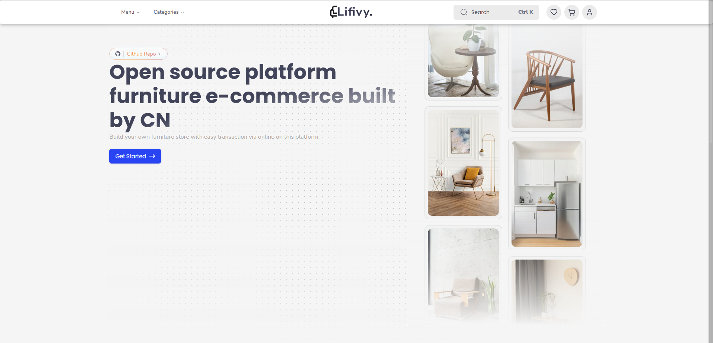

# Livify: Open-Source Furniture E-Commerce Platform

[](https://livify.vercel.app/)
Livify is an open-source e-commerce platform specifically designed for furniture retailers. Built with modern web technologies, it offers a scalable, customizable, and user-friendly solution for businesses looking to establish or upgrade their online presence in the furniture market.

## 🚀 Features

- Responsive, mobile-first design
- User authentication and profile management
- Product catalog with advanced filtering and search capabilities
- Shopping cart and wishlist functionality
- Secure checkout process with Stripe integration
- Admin dashboard for inventory and order management
- Integration with Supabase for robust and scalable data management

## 🛠 Tech Stack

- **Frontend**: [Next.js](https://nextjs.org/) (React framework)
- **Backend**: [Next.js API Routes](https://nextjs.org/docs/api-routes/introduction)
- **Database**: [Supabase](https://supabase.com/) (PostgreSQL)
- **ORM**: [Prisma](https://www.prisma.io/)
- **Styling**: [Tailwind CSS](https://tailwindcss.com/)
- **UI Components**: [shadcn/ui](https://ui.shadcn.com/)
- **Payment Processing**: [Stripe](https://stripe.com/)
- **Language**: [TypeScript](https://www.typescriptlang.org/)

## 🚦 Getting Started

### Prerequisites

- Node.js (v14 or later)
- npm or yarn
- Supabase account
- Stripe account

### Installation

1. Clone the repository:
   ```
   git clone https://github.com/Candra0x6/furnitech.git
   cd livify-app
   ```

2. Install dependencies:
   ```
   npm install
   # or
   yarn install
   ```

3. Set up environment variables:
   Create a `.env.local` file in the root directory and add the following variables:
   ```
   NEXT_PUBLIC_SUPABASE_URL=your_supabase_url
   NEXT_PUBLIC_SUPABASE_ANON_KEY=your_supabase_anon_key
   STRIPE_SECRET_KEY=your_stripe_secret_key
   NEXT_PUBLIC_STRIPE_PUBLISHABLE_KEY=your_stripe_publishable_key
   ```

4. Run the development server:
   ```
   npm run dev
   # or
   yarn dev
   ```

5. Open [http://localhost:3000](http://localhost:3000) in your browser to see the application.

## 🤝 Contributing

We welcome contributions from the community! Please check out our [Contributing Guide](CONTRIBUTING.md) for guidelines on how to proceed.

## 📜 License

This project is licensed under the MIT License - see the [LICENSE](LICENSE) file for details.

## 🙏 Acknowledgements

- [Next.js](https://nextjs.org/)
- [Prisma](https://www.prisma.io/)
- [Tailwind CSS](https://tailwindcss.com/)
- [shadcn/ui](https://ui.shadcn.com/)
- [Supabase](https://supabase.com/)
- [Stripe](https://stripe.com/)

## 📞 Contact

For any queries or support, please open an issue in this repository or contact me kurniawancandram@gmail.com.

---

Happy coding! 🚀🪑
